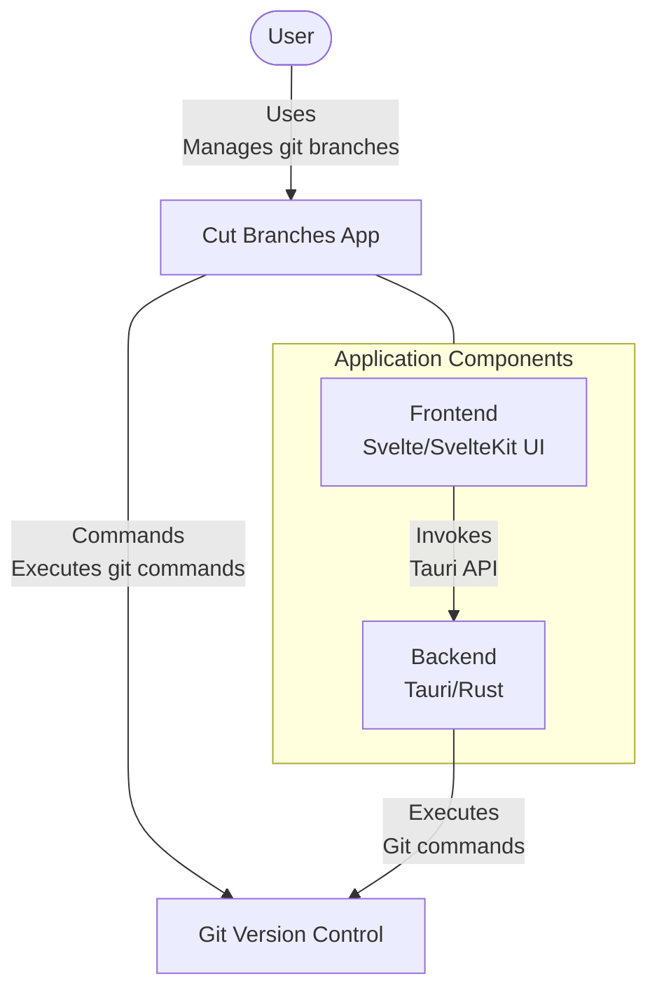

# Cut Branches - System Overview

This diagram shows the high-level architecture of the Cut Branches application.

```mermaid
flowchart TB
    User(["User"])
    CutBranches["Cut Branches App"]
    Git["Git Version Control"]

    subgraph AppComponents["Application Components"]
        Frontend["Frontend\nSvelte/SvelteKit UI"]
        Backend["Backend\nTauri/Rust"]
    end

    User -->|"Uses\nManages git branches"| CutBranches
    CutBranches -->|"Commands\nExecutes git commands"| Git

    Frontend -->|"Invokes\nTauri API"| Backend
    Backend -->|"Executes\nGit commands"| Git

    CutBranches --- AppComponents
```
