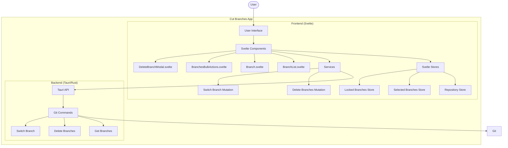

# Cut Branches - Component Diagram

This diagram shows the detailed internal component structure of the Cut Branches application.

```mermaid
flowchart TD
    User(["User"])

    subgraph CutBranchesApp["Cut Branches App"]
        subgraph Frontend["Frontend (Svelte)"]
            UI["User Interface"]
            Components["Svelte Components"]
            Stores["Svelte Stores"]
            Services["Services"]

            %% Component Details
            BranchList["BranchList.svelte"]
            Branch["Branch.svelte"]
            BulkActions["BranchesBulkActions.svelte"]
            DeleteModal["DeleteBranchModal.svelte"]

            %% Store Details
            RepoStore["Repository Store"]
            SelectedStore["Selected Branches Store"]
            LockedStore["Locked Branches Store"]

            %% Service Details
            DeleteMutation["Delete Branches Mutation"]
            SwitchMutation["Switch Branch Mutation"]
        end

        subgraph Backend["Backend (Tauri/Rust)"]
            API["Tauri API"]
            Commands["Git Commands"]

            %% Commands
            GetBranches["Get Branches"]
            DeleteBranches["Delete Branches"]
            SwitchBranch["Switch Branch"]
        end
    end

    Git["Git"]

    %% Connections
    User --> UI
    UI --> Components
    Components --> Stores
    Components --> Services
    Services --> API
    API --> Commands
    Commands --> Git

    %% Component Connections
    Components --> BranchList
    Components --> Branch
    Components --> BulkActions
    Components --> DeleteModal

    %% Store Connections
    Stores --> RepoStore
    Stores --> SelectedStore
    Stores --> LockedStore

    %% Service Connections
    Services --> DeleteMutation
    Services --> SwitchMutation

    %% Command Connections
    Commands --> GetBranches
    Commands --> DeleteBranches
    Commands --> SwitchBranch
```
